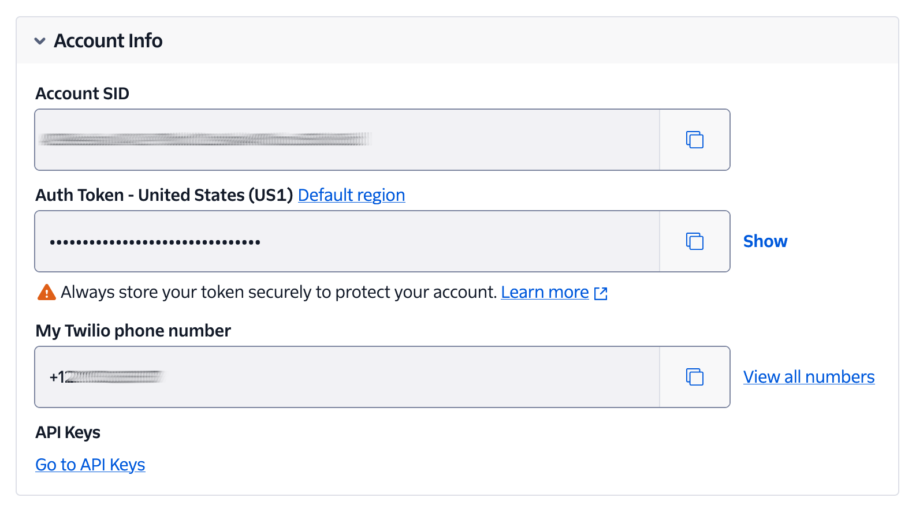

# Phone Number Validator that uses Twilio's Lookup (V2) API


This is a custom laminas-validator class that checks if a phone number is valid by using [Twilio's Lookup API][twilio-lookup-api-url].

## Overview

The package provides a custom laminas-validator class that checks if a phone number is valid by using Twilio's Lookup API, providing a simple way of validating phone numbers are valid, based on communications provider data, accessed through Twilio.

## Requirements

To use the application, you'll need the following:

- A Twilio account (free or paid).
  [Create an account][twilio-referral-url] if you don't already have one.
- PHP 8.3 or 8.4
- [Composer][composer-url] installed globally
- [Git][git-url]

## Getting Started

### Add the Package as a Project Dependency

To use the package in your project, first, either add it in _composer.json_'s `require` attribute, as in the example below.

```json
"require": {
    "settermjd/laminas-twilio-phone-number-validator": "^1.0"
}
```

Or, use `composer require` to add it:

```bash
composer require settermjd/laminas-twilio-phone-number-validator
```

### How to Use the Validator

#### Direct Instantiation

You can use it directly, as in the following example, to validate a phone number.

```php
use Settermjd\Validator\VerifyPhoneNumber;
use Twilio\Rest\Client;

$validator = new VerifyPhoneNumber(new Client(
    `<YOUR_TWILIO_ACCOUNT_SID>`,
    `<YOUR_TWILIO_AUTH_TOKEN>`,
));

if ($validator->isValid($email)) {
    // The phone number is valid, so do what you want knowing that.
} else {
    // The phone number is not valid, so show the reasons why.
    foreach ($validator->getMessages() as $messageId => $message) {
        printf("Validation failure '%s': %s\n", $messageId, $message);
    }
}
```

#### Used with laminas-inputfilter

Or, you can use it in conjunction with [laminas-inputfilter][laminas-inputfilter-url], as in the following example.

```php
use Laminas\InputFilter\InputFilter;
use Laminas\InputFilter\Input;
use Laminas\Validator;
use Settermjd\Filter\QueryParametersFilter;
use Settermjd\Validator\VerifyPhoneNumber;
use Twilio\Rest\Client;

$phoneNumber = new Input('phone_number');
$phoneNumber->getValidatorChain()
          ->attach(
          new VerifyPhoneNumber(
              new Client(
                  `<TWILIO_ACCOUNT_SID>`,
                  `<TWILIO_AUTH_TOKEN>`,
              ),
              new QueryParametersFilter(),
          )
    );

$inputFilter = new InputFilter();
$inputFilter->add($phoneNumber);

$inputFilter->setData($_POST);
if ($inputFilter->isValid()) {
    echo "The form is valid\n";
} else {
    echo "The form is not valid\n";
    foreach ($inputFilter->getInvalidInput() as $error) {
        print_r($error->getMessages());
    }
}
```

In both of the above examples, the `VerifyPhoneNumber` validator is initialised with a `Twilio\Rest\Client` object, which in turn is initialised with a Twilio Account SID and Auth Token.
To retrieve these, open [the Twilio Console][twilio-console-url] in your browser of choice, then copy the **Account SID** and **Auth Token** from the **Account Info**, as you can see in the screenshot below.



> [!CAUTION]
> Use a package such as [PHP Dotenv][phpdotenv-url] to keep credentials, such as the Twilio Account SID and Auth Token out of code, and avoid them accidentally being tracked by Git (or your version control tool of choice), or your deployment tool's secrets manager is strongly encouraged.

#### Use in Mezzio Applications

If you use this package with [Mezzio applications][mezzio-docs-url], you don't need to do anything to instantiate or configure a `VerifyPhoneNumber` instance, as you do in the two previous examples.
Rather, you can just retrieve a fully configured instance from the application's DI/Service container, such as in the example below.

```php
use Settermjd\LaminasPhoneNumberValidator\Validator\VerifyPhoneNumber;

// Retrieve an instance from the container
$container->get(VerifyPhoneNumber::class);
```

### Supply Query Parameters

Query parameters allow you to retrieve additional data during the lookup, such as [when the SIM was last swapped](https://www.twilio.com/en-us/blog/how-to-detect-sim-swap-with-php-before-sending-sms-otp), and whether call forwarding is enabled.

To set them:

- Pass an array of [query parameters supported by Twilio's Lookup (V2) API][twilio-lookup-api-query-parameters-url] of them to the constructor
- Pass an array of them to a call to the `setQueryParameters()` function

```php
use Settermjd\Filter\QueryParametersFilter;
use Settermjd\Validator\VerifyPhoneNumber;
use Twilio\Rest\Client;

$validator = new VerifyPhoneNumber(
  new Client(
      `<YOUR_TWILIO_ACCOUNT_SID>`,
      `<YOUR_TWILIO_AUTH_TOKEN>`,
  )
  new QueryParametersFilter(),
)->setQueryParameters(
  [
      'fields'             => 'sim_swap,call_forwarding',
      'firstName'          => 'Matthew',
      'lastName'           => 'Setter',
      'lastVerifiedDate'   => '20240123',
      'nationalId'         => 'MX12345678',
  ]
);
```

The method supports either an array of [supported query parameters](https://www.twilio.com/docs/lookup/v2-api#query-parameters-1), or a `QueryParameter` object.

> [!CAUTION]
> Be aware that some query parameters, such as in `Field`s require data packages which will incur charges on your account. Please double-check your code before running it so that you don't accidentally incur excessive unintended Lookup charges.

### Filter and validate query parameters

To ensure that the query parameters provided to the validator are valid, you can use the `QueryParametersInputFilter`.
This is a custom [laminas-inputfilter](https://docs.laminas.dev/laminas-inputfilter/intro/) class which ensures that the query parameter data provided is valid, and doesn't contain malicious information or values unsupported by the Lookup API.

```php
use Laminas\InputFilter\InputFilter;
use Laminas\InputFilter\Input;
use Laminas\Validator;
use Settermjd\InputFilter\QueryParametersInputFilter;
use Settermjd\Validator\VerifyPhoneNumber;
use Twilio\Rest\Client;

$inputFilter = new QueryParametersInputFilter();
$inputFilter->setData($suppliedQueryParameters);
if ($inputFilter->isValid()) {
    $validator = new VerifyPhoneNumber(
        new Client(
            `<YOUR_TWILIO_ACCOUNT_SID>`,
            `<YOUR_TWILIO_AUTH_TOKEN>`,
        ),
        new QueryParametersFilter(),
    );

    if ($validator->isValid($email)) {
        // The phone number is valid, so do what you want knowing that.
    } else {
        // The phone number is not valid, so show the reasons why.
        foreach ($validator->getMessages() as $messageId => $message) {
            printf("Validation failure '%s': %s\n", $messageId, $message);
        }
    }
}
```

In the example above, the query parameters (`$suppliedQueryParameters`) are checked with `QueryParametersInputFilter`.
If the data is valid, then the `VerifyPhoneNumber` validator is instantiated and used; that code is exactly the same as in the first example above.
If one or more of the query parameters are not valid, then an exception will be thrown, containing information about which query parameter was not valid and why.

### Add Caching Support

The validator is [PSR-16][psr16-url]-compliant.
So, if you want to further enhance performance, when initialising a `VerifyPhoneNumber` object, provide an object that implements [CacheInterface][cacheinterface-url] as the third argument; the example below uses [laminas-cache][laminascache-psr16-url].

```php
use Laminas\Cache\Psr\SimpleCache\SimpleCacheDecorator;
use Laminas\Cache\Service\StorageAdapterFactoryInterface;
use Psr\Container\ContainerInterface;
use Settermjd\InputFilter\QueryParametersInputFilter;
use Settermjd\Validator\VerifyPhoneNumber;
use Twilio\Rest\Client;

/** @var ContainerInterface $container */
$container = null; // can be any configured PSR-11 container

$storageFactory = $container->get(StorageAdapterFactoryInterface::class);
$storage = $storageFactory->create('apc');

$validator = new VerifyPhoneNumber(
    new Client(`<YOUR_TWILIO_ACCOUNT_SID>`, `<YOUR_TWILIO_AUTH_TOKEN>`), 
    new QueryParametersFilter(),
    cache: new SimpleCacheDecorator($storage),
);
```

If you're not sure which PSR-16 implementation to use, [check out the full list of providers on Packagist][simplecache-implementation-url].

## Contributing

If you want to contribute to the project, whether you have found issues with it or just want to improve it, here's how:

- [Issues][github-issues-url]: ask questions and submit your feature requests, bug reports, etc
- [Pull requests][github-pr-url]: send your improvements

## Did You Find the Project Useful?

If the project was useful, and you want to say thank you and/or support its active development, here's how:

- Add a GitHub Star to the project
- Write an interesting article about the project wherever you blog

[cacheinterface-url]: https://www.php-fig.org/psr/psr-16/#21-cacheinterface
[composer-url]: https://getcomposer.org
[git-url]: https://git-scm.com/downloads
[twilio-console-url]: https://console.twilio.com/
[twilio-referral-url]: http://www.twilio.com/referral/QlBtVJ
[github-issues-url]: https://github.com/settermjd/laminas-phone-number-validator/issues
[github-pr-url]: https://github.com/settermjd/laminas-phone-number-validator/pulls
[laminascache-psr16-url]: https://docs.laminas.dev/laminas-cache/v4/psr16/
[laminas-inputfilter-url]: https://docs.laminas.dev/laminas-inputfilter/
[mezzio-docs-url]: https://docs.mezzio.dev/mezzio/
[phpdotenv-url]: https://github.com/vlucas/phpdotenv
[psr16-url]: https://www.php-fig.org/psr/psr-16/
[simplecache-implementation-url]: https://packagist.org/providers/psr/simple-cache-implementation
[twilio-lookup-api-url]: https://www.twilio.com/docs/lookup
[twilio-lookup-api-query-parameters-url]: https://www.twilio.com/docs/lookup/v2-api#query-parameters-1
